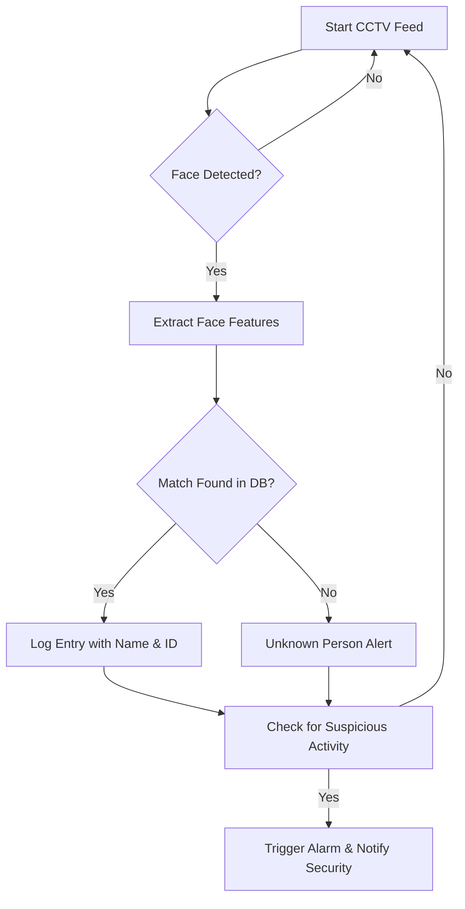

# 📄 Software Requirement Specification (SRS)
## Project: CCTV-based Face Recognition Security Guard System

---

## 1. Introduction  

### 1.1 Purpose  
The purpose of this project is to build an **AI-powered security guard system** using CCTV (or webcam for prototype). The system will:  
- Recognize faces in **live video streams** or **recorded CCTV footage**.  
- Maintain a **database of registered individuals** (Name, ID, Course, etc.).  
- Detect suspicious activities (e.g., glass breaking, vandalism, unauthorized entry).  
- Allow **manual photo input** to search for an individual in past recordings.  

This project aims to **reduce manual workload** of security guards and ensure **faster, more accurate monitoring**.  

---

### 1.2 Scope  
This system is designed for **educational institutes, offices, and residential communities** where security is crucial.  

**Users:**  
- Security Guards (operational monitoring).  
- Administrators (database & system management).  

**System Features:**  
- Face recognition with logging.  
- Search capability across past CCTV feeds.  
- Dynamic database of individuals.  
- Suspicious activity detection with alerts.  

---

## 2. STAR Analysis  

### Situation  
Security guards manually monitor CCTV feeds for suspicious activities and identification, which is inefficient and error-prone.  

### Task  
Build a system that automates **face detection, identification, suspicious activity detection, and recorded video search**.  

### Action  
- Use **OpenCV + Deep Learning (CNN / FaceNet / Dlib)** for face recognition.  
- Store metadata such as **FaceID, Name, ID, Time, Camera Location**.  
- Develop an **interactive dashboard** for monitoring and searching.  
- Implement alerting mechanism (sound alarms, email/SMS notifications).  

### Result  
- **Reduced human dependency** on 24/7 monitoring.  
- **Instant alerts** for unauthorized access.  
- **Faster investigation** of past events.  
- **Improved security** with automated logging and AI-powered analysis.  

---

## 3. Functional Requirements  

1. **Face Recognition**  
   - Detect faces in live CCTV feed.  
   - Match faces with database (Known/Unknown).  
   - Store logs with timestamp, camera location, and identification status.  

2. **Recorded Video Search**  
   - Allow input of a photo to search across stored recordings.  
   - Extract frames & detect matching persons.  
   - Generate report of occurrences with time & camera ID.  

3. **Database Management**  
   - Admin can **Add/Update/Delete persons** with details (Name, ID, Course, Photo).  
   - Maintain data integrity.  
   - Manage attendance/activity logs for analysis.  

4. **Suspicious Activity Detection**  
   - AI model trained for detecting actions like:  
     - Breaking glass, vandalism.  
     - Unauthorized entry at night.  
     - Loitering in restricted areas.  
   - Alerts security via **alarm sound + email/SMS notification**.  

---

## 4. Non-Functional Requirements  

- **Performance**: Live video feed must be processed with ≤ 1-second delay.  
- **Accuracy**: Face recognition accuracy ≥ 90%, activity detection ≥ 85%.  
- **Scalability**: Must handle multiple CCTV streams simultaneously.  
- **Reliability**: System uptime ≥ 99%.  
- **Security**: Encrypted databases, role-based authentication.  
- **Usability**: User-friendly dashboard with minimal training required.  

---

## 5. System Flow  

### 5.1 High-Level Flowchart  


---

## 6. Use Case Diagram  

```mermaid
%% Use Case Diagram for Face Recognition Security System
usecaseDiagram
actor Admin
actor Security

Admin --> (Add/Update Person in DB)
Security --> (Monitor Live CCTV)
Security --> (Search Recorded Video)
Security --> (Receive Alerts)

system "Face Recognition Security" {
  (Face Recognition)
  (Database Management)
  (Suspicious Activity Detection)
  (Recorded Video Search)
}


## 7. Database Schema  

### **Persons Table**  
- PersonID (PK)  
- Name  
- Course  
- ID_No  
- Photo  

### **Logs Table**  
- LogID (PK)  
- PersonID (FK)  
- Timestamp  
- CameraID  
- Status (Known/Unknown)  

### **Cameras Table**  
- CameraID (PK)  
- Location  

---

## 8. System Architecture  

```mermaid
flowchart LR
    User --> Dashboard
    Dashboard --> Backend[Flask/Django Backend]
    Backend --> DB[(PostgreSQL/MySQL)]
    Backend --> AI[Face Recognition Engine]
    AI --> CCTV[CCTV/Recorded Video]
    Backend --> Alerts[Notification Service]
```

---

## 9. Constraints  

- Requires **GPU acceleration** for real-time face recognition.  
- CCTV footage storage must be large enough to keep 30+ days of video.  
- Internet connectivity needed for **cloud backups & remote alerts**.  

---

## 10. Future Enhancements  

- Integration with **biometric fingerprint/RFID systems**.  
- **Mobile app** for instant security alerts.  
- **Multi-camera person tracking** across locations.  
- Predictive analytics for **crime hotspot detection**.  
- Integration with government ID databases.  

---

## 11. Glossary  

- **CCTV**: Closed-circuit television; surveillance system with cameras.  
- **FaceID**: Unique vector representation of a facial image.  
- **Suspicious Activity**: Unusual behavior (breaking glass, forced entry, etc.).  
- **Dashboard**: Web interface for monitoring feed and managing data.  

---

## 12. Conclusion  

This system leverages **AI + CCTV** to act as a **digital security guard**.  
It reduces manual monitoring, increases **response speed**, and improves **overall security infrastructure**.  

By automating face recognition, activity detection, and alerts, it ensures **proactive security management** in educational institutions, corporate offices, and residential societies.  
